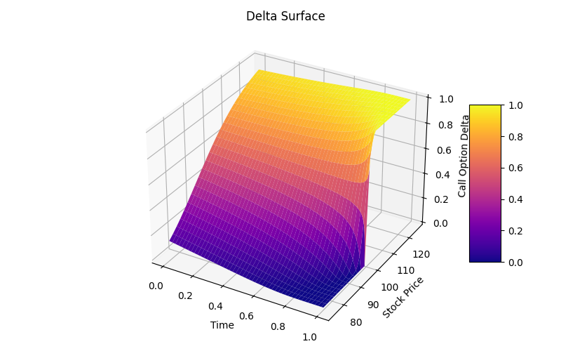
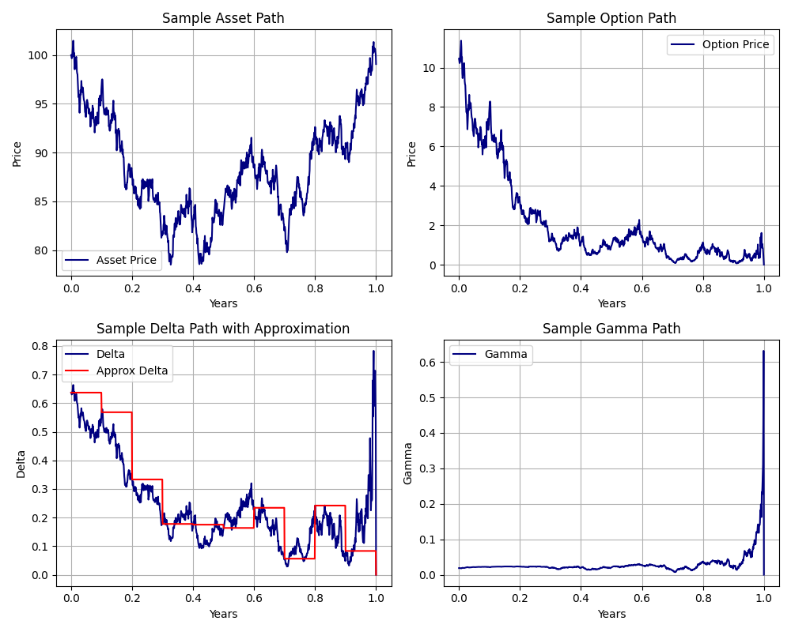
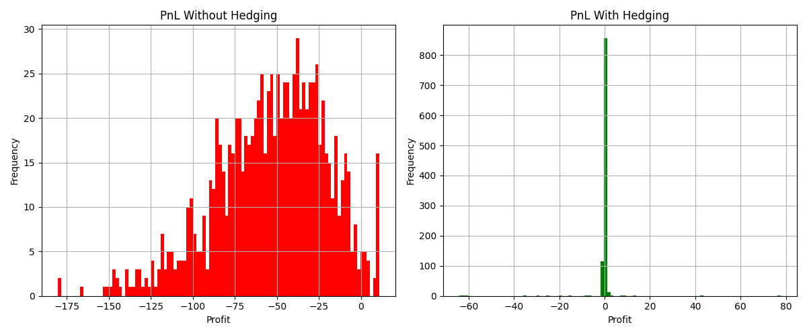

# Black-Scholes Model Implementation

---

### Overview

A mathematical and computational implementation of the Black–Scholes model for European option pricing, including derivation sketches, explicit solutions, simulation of underlying paths, and numerical delta hedging verification. This project bridges continuous-time financial theory and practical discrete-time implementation.

---

### Features

- A pdf showcasing theory:
    - Assumptions.
    - Black-Scholes equation.
    - Heat equation vs Feynman-Kac formula, and equivalence.
    - Black-Scholes formula.
    - Explicit pricing functions for vanilla options.
- Option classes, with methods for pricing and Greeks.
- Addition operator overriding to instantiate linear combinations of options. E.g. butterfly spread.
- Simulation of geometric Brownian motion sample paths.
- Delta hedging strategy implementation.
- Delta hedging analysis:
    - PnL of hedged portfolio vs unhedged control group.
    - Convergence analysis of discretisation error vs rebalancing frequency.
    - Confirmation of drift-independence of delta hedge.
- Figures:
    - Sample underlying paths.
    - Payoff functions.
    - Option price and Greek surfaces.
    - Discrete hedging approximations.
    - PnL histograms.
    - Hedging error convergence using log-log plots.
    - Drift-independence.

---

### Key Visualisations

- Call delta surface showing sensitivity of option value to the underlying. The transition from 0 to 1 across moneyness is clearly visible at maturity as the sigmoid slope converges to the step function.

- Simulated geometric Brownian motion path with corresponding option price, delta, and gamma evolution. Demonstrates dynamic sensitivity as maturity approaches.

- Comparison of unhedged and delta-hedged PnL. Hedging significantly reduces variance and confirms convergence toward theoretical replication as rebalancing frequency increases.

---

### Technologies

- LaTeX (MikTex, TexMaker).
- Visual Studio Code.
- Python.
- Jupyter.
- NumPy.
- SciPy.
- Matplotlib.

---

### Outcome and Conclusion

This project delivers a complete theoretical and computational implementation of the Black–Scholes framework introduced by Fischer Black and Myron Scholes. The analytical pricing formula, Greeks, and PDE derivation were translated into reusable, object-oriented code, with support for structured payoffs via linear combinations of options.

Simulations of geometric Brownian motion and discrete delta hedging experiments validate key theoretical results:

- PnL converges towards zero under a hedged portfolio.
- Hedging error decreases with higher rebalancing frequency.
- Pricing and replication are drift-independent under risk-neutral dynamics.

Overall, the project bridges continuous-time financial theory and practical numerical implementation, providing a solid foundation for extending beyond the classical Black–Scholes model.

---

### Future Extensions

- Add a pdf to mathematically analyse the theoretical discretisation error.
- Distribution analysis of PnL (e.g. with KDE).
- Volatility study:
    - Implied volatility solver.
    - Empirical data, and the volatility plots (smile, skew, surface).
    - PnL skew under volatility misspecification.
- Implementation and comparison (e.g. tractability vs computational speed) of alternate pricing methods:
    - Explicit formula (already implmented).
    - Directly applying numerical integration of Black-Scholes formula.
    - FFT pricing.
    - Monte Carlo pricing.
- Black-Scholes extended model:
    - American option pricing (smooth pasting).
    - Dividend-paying assets (both continuous and discrete cases).
- Testing framework (pytest or unittest).
- Advanced hedging implementation:
    - Accounting for and minimising transaction costs.
    - Minimising hedging frequency by only adjusting delta when gamma hits a threshold.
- Exotic models:
    - Lévy processes (fat tails and jumps).
    - Stochastic volatility (Heston and rough Heston).

---
